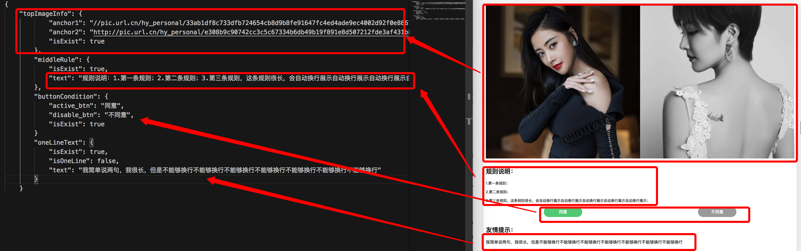

# 示例一

本文介绍如何对一个简单静态页面书写自动化测试代码。

## 示例项目

如果读者已经将示例项目下载下来，并使用`npm start`在本地运行起整个项目了的话，可以在http://localhost:3000/simple下 查看示例项目的界面，如下图


接下来我们针对这个项目书写其测试代码。

## 安装全局依赖

该部分参见[安装和升级](../installation/install.md)

## 建立项目

在测试目录下，运行如下命令：

```bash
matman init project
```

按照提示操作即可，命令运行完之后会在当前目录下生成一个默认名字为matman-app的测试文件夹

进入该目录，运行如下命令。

```bash
matman init tester
```

可以看到如下输出：

```bash
? 请选择 tester 放置的根目录 (Use arrow keys)
❯ /Users/hebly723/git/cookbook_demo/matman-app/src/testers 
```

可以选择自定义的目录，但是建议按默认的即可，直接回车。

```bash
? 请输入需要测试的页面，例如： http://domain.com/index.html 
```

这里输入要测试的页面的链接，示例项目的链接是 `http://localhost:3000/simple` ，因此我们可以在这里输入这个


同理，接下来按提示操作即可。

应如下这般

```bash

欢迎使用 Matman 脚手架来创建 tester

? 请选择 tester 放置的根目录 /Users/hebly723/git/cookbook_demo/matman-app/src/testers
? 请输入需要测试的页面，例如： http://domain.com/index.html http://localhost:3000/simple
? 请输入开始爬虫的标志dom，例如： #root .App #root
? 请输入tester名称，只能够输入英文、数字和、- 及 _  page-simple
   create crawlers/get-page-info.js
   create env/index.js
   create cases/basic-check/index.js
   create cases/basic-check/index.test.js
mockstar INFO  项目初始化完成
mockstar INFO  本次初始化过程结束。
```

然后我们可以进入对应的的 `tester` 目录

可以看到 `tester` 下有两个文件夹， `demo_tester` 和 `page-simple` ，`demo_tester` 是创建项目时附带的示例代码， `page-simple` 是我们刚刚创建的测试文件。


## 设置运行时参数

 `cases` 文件夹存储的是测试文件夹，一个测试文件夹中通常包含两个文件： `index.js` 和 `index.test.js` 。

其中：

-  `index.js` 中包含对测试过程的设置，比如测试页面的大小，测试时数据的 `mock` ，测试过程中的模拟操作等。
-  `index.test.js` 中包含对各个阶段测试数据的比较和测试。

对测试思想还希望有深入了解的可以参考 [数据快照](../main-concepts/data-snapshot.md)

关注 `page-simple` 下的 `cases` 文件夹中 `basic-check` 里的 `index.js` 文件，可以看到如下代码

```js
const env = require('../../env');

function getResult(opts) {
    // 1. 获取 caseParser对象
    const caseParser = env.getCaseParser(__dirname);

    // 2. 获取页面的 url
    let pageUrl = env.getPageUrl(true);

    // 3. 获取 crawlerScript 爬虫脚本路径
    let crawlerScriptPath = caseParser.getCrawlerScriptPath('../../crawlers/get-page-info');

    // 4. 获得一些配置参数
    opts = Object.assign({
        proxyServer: env.getProxyServer(true),
        wait: env.OPTS.WAIT,
        screenshot: true
    }, opts);

    // console.log('-pageUrl-', pageUrl);
    // console.log('-crawlerScriptPath-', crawlerScriptPath);
    // console.log('-opts-', opts);

    // 5. 执行并返回 Promise 结果
    return caseParser.handleScan(pageUrl, crawlerScriptPath, opts);
}

module.exports = getResult;

// getResult({ show: true, doNotEnd: false, useRecorder: false })
//     .then(function (result) {
//         console.log(JSON.stringify(result));
//     })
//     .catch(function (error) {
//         console.error('failed:', error);
//     });
```

- `caseParse` 是用来指定测试代码所在位置的方法，默认指定的是当前文件夹。

- `pageUrl` 即为要测试的页面的地址，可以进入对应的 `env` 文件夹下的 `index.js` 中修改为本用例对应的页面地址，即 `http://localhost:3000/simple`

- `crawlerScriptPath` 对应的是爬虫脚本，即通常名为`get-page-info`的文件，在`getCrawlerScriptPath()`中传对应文件的相对路径来引用

- `reqOpts`中存储一些运行时的信息，包括是否在测试过程中代理服务器，等待时间，是否截屏等等。其中
    - `proxyServer`用来判断是否要使用代理，在`env.getProxyServer()`方法中传`true`时，`matman`运行时会使用`8080`端口作为自己的代理端口；设置为`false`时，`matman`运行时直接走现网不使用任何代理。如果想使用其余的端口可以在lib/utils.js下的`getProxyServer`方法中再行设置。本例中，因为我们没有设置代理服务器，因此在 `env.getProxyServer()` 中应该传 `false` 
    - `wait`用来判定何时认为页面已经加载完。`OPTS.WAIT`对应的值有两种形式。可以直接接数字代表加载时间（单位为秒）；也可以接上代码中所示的选择器，监听到该选择器对应的元素存在即代表页面加载完成，可以在对应的文件下进行修改。
    - `screenshot`用来设置是否要在用例执行过程中进行截图，设置为`true`则用例运行的每一步都会有对应的截图；设置为`false`则不会有截图。

 `reqOpts` 的参数和对应的意义可以参考 [matman文档](https://www.npmjs.com/package/matman#213-handleoperatepageurl-crawlerscriptpath-opts---callaction)

设置好了运行时参数之后，可以开始书写爬虫脚本了。

## 爬虫脚本

matman测试的思路可以这么简化理解：按照用例运行操作，记录每一步的操作时界面上的信息，和正确的信息进行比对。

为了获取界面上的信息，就需要书写爬虫脚本。

可以将示例页面的信息从上到下大致分为四部分：

- 上方的两个图片，其中的关键信息是两个图片的地址
- 中间的规则说明，其中的关键信息是规则说明的文案
- 中下部的两个按钮，其中的关键信息是按钮的样式
- 最下方的友情提示，其中的关键信息是友情提示的文案和友情提示是否正常单行展示

预期能够提取出如下信息：



对于页面有个大致的模块划分之后，接下来就可以开始写爬虫脚本了。


### 顶部图片

首先定义一个获取顶部图片信息的方法

```js
/**
 * 顶层图片信息
 */
function getTopImageInfo() {
    
}
```

打开chrome控制台来查看页面元素，可以看到顶部两个图片的代码如下：

```html
<div id="anchors" class="section">
    
    <div class="use-background" 
    style="background-image: url(&quot;//pic.url.cn/hy_personal/e308b9c90742cc3c5c67334b6db49b19f891e8d507212fde3af431b8b8597b02/640&quot;);"></div>
</div>
```

首先可以看到，两个图片同属于大的id为anchors的div，因此可以先判断这个div元素是否存在，存在的情况下再去提取内部两个图片的信息

爬虫脚本中支持使用jquery语法，因此可以使用$(选择器)的方式获取到元素的数量，从而判断是否存在该元素

```js
const parentSelector = '#anchors';
const result = {
    isExist: $(parentSelector).length > 0
};
```

同时matman也提供了封装好的方法来提取元素的信息，要使用封装的方法，需要在头部引用对应的文件。

```js
const {
    useJquery
} = require('web-crawl-util');
```

获取父选择器的代码如果是使用useJquery的话，可以如下这般书写。

```js
const parentSelector = '#anchors';

const result = {
    isExist: useJquery.isExist(parentSelector)
};
```

当parentSelector存在时，开始进行图片的爬取。
如上，可以用jQuery的方式获取到两个元素的图片地址，示例代码如下：

```js
if (result.isExist) {
        result.anchor1 = $.trim($('.use-img', parentSelector).attr('src'));
        result.anchor2 = (document.defaultView.getComputedStyle(
            $('.use-background', parentSelector)[0]
        ).backgroundImage.match(/url\("(.*)"\)/) || [])[1] || '';
    }
```

同理，使用useJquery可以这样书写

```js
if (result.isExist) {
    result.anchor1 = useJquery.getImageDomUrl('.use-img', parentSelector);
    result.anchor2 = useJquery.getBackgroundImageUrl('.use-background', parentSelector);
}
```

最后将得到的结果返回，一个完整的爬取顶层图片的函数就书写完了。

### 规则

同理，先建立一个方法

```js
/**
 * 规则说明
 */
function getMiddleRule() {

}
```

打开chrome控制台来查看页面元素，可以看到中央规则的代码如下：

```html
<div id="rules" class="section">
    <h2>规则说明：</h2>
    <p>1.第一条规则；</p>
    <p>2.第二条规则；</p>
    <p>3.第三条规则，这条规则很长，会自动换行展示自动换行展示自动换行展示自动换行展示自动换行展示；</p>
    <div class="btn-group">
        <div class="btn active">同意</div>
        <div class="btn disable">不同意</div>
    </div>
</div>
```

可以看到它的父元素的id为rules，因此可以用如下的方式去判断它是否存在

```js
//jQuery写法
const parentSelector = '#rules';

const result = {
    isExist: $(parentSelector).length > 0
};


//useJquery写法
const parentSelector = '#rules';

const result = {
    isExist: useJquery.isExist(parentSelector)
};
```

同理，可以用如下的方式获取规则的内容

```js
//jQuery写法
if (result.isExist) {
    result.text = $.trim($(parentSelector).text());
}


//useJquery写法
if (result.isExist) {
    result.text = useJquery.getText(parentSelector);
}

```

最后将结果返回，获取规则内容的脚本就完成了

### 按钮

同样需要建立一个方法

```js
/**
 * 获取按钮状态
 */
function getButtonCondition() {

}
```

检查父元素是否存在

```js
//jQuery写法
const parentSelector = '.btn-group';

const result = {
    isExist: $(parentSelector).length > 0
};


//useJquery写法
const parentSelector = '.btn-group';

const result = {
    isExist: useJquery.isExist(parentSelector)
};
```


这里是需要爬取按钮的信息，示例中我们只需要获取按钮的值即可，

示例如下

```js
//jQuery写法
if (result.isExist) {
    result.active_btn = $.trim($('.active', parentSelector).text());
    result.disable_btn = $.trim($('.disable', parentSelector).text());
}


//useJquery写法
if (result.isExist) {
    result.active_btn = useJquery.getText('.active', parentSelector);
    result.disable_btn = useJquery.getText('.disable', parentSelector);
}
```

最后将结果返回，获取按钮值的脚本就完成了

### 友情提示

经过之前的示例，我们可以直接将这部分代码写出来

```js
//jQuery写法
function getOneLineText() {
    const parentSelector = '#tips';

    const result = {
        isExist: $(parentSelector).length > 0
    };

    if (result.isExist) {
        let computedStyle = document.defaultView.getComputedStyle($('div.long-word', parentSelector)[0]);
        result.isOneLine = parseInt(computedStyle.height) === parseInt(computedStyle.lineHeight);
        result.text = $.trim($('div.long-word', parentSelector).text());
    }

    return result;
}


//useJquery写法
function getOneLineText() {
    const parentSelector = '#tips';

    const result = {
        isExist: useJquery.isExist(parentSelector)
    };

    if (result.isExist) {
        result.isOneLine = useJquery.getStyle('div.long-word', parentSelector).isOneLine;
        result.text = useJquery.getText('div.long-word', parentSelector);
    }

    return result;
}
```


最后将爬取元素的函数提供给外部调用，如下

```js
module.exports = () => {
    return {
        //顶部图片信息获取
        topImageInfo: getTopImageInfo(),
        //中央规则信息获取
        middleRule: getMiddleRule(),
        //按钮状态信息获取
        buttonCondition: getButtonCondition(),
        //单行文本信息获取
        oneLineText: getOneLineText()
    };
};
```

这样一个爬虫脚本文件就完成了，接来下就需要在测试文件中获取这些信息进行比对了

## 测试文件

测试文件在index.js同级目录下，常以index.test.js的文件名出现

matman的测试框架基于mocha+chai，因此首选需要在头部引入chai这个模块。

```js
const expect = require('chai').expect;
```

用例的书写规则具体参见 [mocha官网教程](https://mochajs.org/)

首先可以书写一份空的用例

```js

describe('simple.html：常规检查-普通静态页面', function () {
});

```

然后可以设置一个超时时间，即测试用例运行的最长时间，如果超过这个时间认为是用例执行失败

```js
this.timeout(30000);
```

测试过程的参数默认会按照在index.js中的设定，但是也可以基于每一条用例定制不同的参数，这个时候我们可以在头部引入index.js模块

```js
const checkPage = require('.');
```

在测试用例执行前修改index.js的参数。

```js
before(function () {
    return checkPage({ show: false, doNotEnd: false, useRecorder: true })
        .then(function (result) {
            // console.log(JSON.stringify(result));
            resultData = result;
        });
});
```

checkPage中传的参数释义

- show： 运行时是否展示界面，false则不展示
- doNotEnd：运行结束是否关闭进程
- useRecorder：是否每一步操作都进行截图

checkPage传的result中，包含爬虫脚本在页面上运行结束后获取到的信息，使用变量resultData将其存储起来。

此时代码如下：

```js
const expect = require('chai').expect;

const checkPage = require('.');

describe.only('simple.html：常规检查-普通静态页面', function () {
    this.timeout(30000);

    let resultData;

    before(function () {
        return checkPage({ show: false, doNotEnd: false, useRecorder: true })
            .then(function (result) {
                // console.log(JSON.stringify(result));
                resultData = result;
            });
    });
});
```

这边使用descripe.only是为了只运行这一条用例
接下来即可开始书写测试用例。对于我们要测试的页面，测试内容其实是检查它的基本信息，那么，就可以先写个架子。

```js
describe('检查基本信息', function () {

});
```

在开始测试前，我们需要获取到存储在resultData中的爬虫脚本获取到的值，爬虫脚本的值存储在resultData中key为data对应的值中。

```js
let data;

before(function () {
        data = resultData.data;
});

```

获取到这个值之后就可以开始书写测试用例了。首先我们写一下检查顶层图片的用例。

顶层图片的爬虫方法名为topImageInfo，那么它在data中的key就为topImageInfo，而返回的结果中包含anchor1, anchor2, exist三个变量，因此我们可以按如下的方式书写测试用例。

```js
it('顶层图片检查通过', function () {
    expect(data.topImageInfo).to.eql({
        'anchor1': '//pic.url.cn/hy_personal/33ab1df8c733dfb724654cb8d9b8fe91647fc4ed4ade9ec4002d92f0e8867248/640',
        'anchor2': 'http://pic.url.cn/hy_personal/e308b9c90742cc3c5c67334b6db49b19f891e8d507212fde3af431b8b8597b02/640',
        'isExist': true
    });
});
```
同理可以书写其余三个的测试用例：

```js
it('规则文案检查通过', function () {
    expect(data.middleRule).to.eql({
        'isExist': true, 
        'text': '规则说明：1.第一条规则；2.第二条规则；3.第三条规则，这条规则很长，会自动换行展示自动换行展示自动换行展示自动换行展示自动换行展示；同意不同意'
    });
});

it('按钮样式检查通过', function () {
    expect(data.buttonCondition).to.eql({
        'isExist': true,
        'active_btn': '同意',
        'disable_btn': '不同意'
    });
});

it('文字单行检查通过', function () {
    expect(data.oneLineText).to.eql({
        'isExist': true,
        'isOneLine': false,
        'text': '我简单说两句，我很长，但是不能够换行不能够换行不能够换行不能够换行不能够换行不能够换行不能够换行'
    });
});
```

当然，如果不想分的这么仔细的话，可以把四条用例合在一起

```js
it('数据快照检查', function () {
    expect(data).to.eql({
        "topImageInfo": {
            "anchor1": "//pic.url.cn/hy_personal/33ab1df8c733dfb724654cb8d9b8fe91647fc4ed4ade9ec4002d92f0e8867248/640",
            "anchor2": "http://pic.url.cn/hy_personal/e308b9c90742cc3c5c67334b6db49b19f891e8d507212fde3af431b8b8597b02/640",
            "isExist": true
        },
        "middleRule": {
            "isExist": true,
            "text": "规则说明：1.第一条规则；2.第二条规则；3.第三条规则，这条规则很长，会自动换行展示自动换行展示自动换行展示自动换行展示自动换行展示；同意不同意"
        },
        "buttonCondition": {
            "active_btn": "同意",
            "disable_btn": "不同意",
            "isExist": true
        }
        "oneLineText": {
            "isExist": true,
            "isOneLine": false,
            "text": "我简单说两句，我很长，但是不能够换行不能够换行不能够换行不能够换行不能够换行不能够换行不能够换行"
        }
    });
});
```

整个测试代码如下：

```js
const expect = require('chai').expect;

const checkPage = require('.');

describe('simple.html：常规检查-普通静态页面', function () {
    this.timeout(30000);

    let resultData;

    before(function () {
        return checkPage({ show: false, doNotEnd: false, useRecorder: true })
            .then(function (result) {
                // console.log(JSON.stringify(result));
                resultData = result;
            });
    });

    describe('检查基本信息', function () {
        let data;

        before(function () {
            data = resultData.data;
        });

        it('顶层图片检查通过', function () {
            expect(data.topImageInfo).to.eql({
                'anchor1': '//pic.url.cn/hy_personal/33ab1df8c733dfb724654cb8d9b8fe91647fc4ed4ade9ec4002d92f0e8867248/640',
                'anchor2': 'http://pic.url.cn/hy_personal/e308b9c90742cc3c5c67334b6db49b19f891e8d507212fde3af431b8b8597b02/640',
                'isExist': true
            });
        });

        it('规则文案检查通过', function () {
            expect(data.middleRule).to.eql({
                'isExist': true, 
                'text': '规则说明：1.第一条规则；2.第二条规则；3.第三条规则，这条规则很长，会自动换行展示自动换行展示自动换行展示自动换行展示自动换行展示；同意不同意'
            });
        });

        it('按钮样式检查通过', function () {
            expect(data.buttonCondition).to.eql({
                'isExist': true,
                'active_btn': '同意',
                'disable_btn': '不同意'
            });
        });

        it('文字单行检查通过', function () {
            expect(data.oneLineText).to.eql({
                'isExist': true,
                'isOneLine': false,
                'text': '我简单说两句，我很长，但是不能够换行不能够换行不能够换行不能够换行不能够换行不能够换行不能够换行'
            });
        });
    });
});
```

这样子我们就完成了所有的测试代码，执行代码的方式参见 [启动和运行](./start.md)