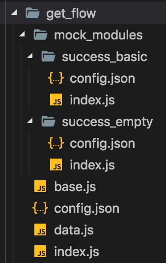

# 示例二

运行示例项目后，示例二的页面地址为http://localhost:3000/transaction ，但是直接访问可以看到什么都没有，这是因为示例二的页面发送的http请求没有数据导致的。

## mockstar

本例中我们使用mockstar提供请求数据来渲染页面，以下会介绍mockstar的简单操作，mockstar的具体说明参见[mockstar文档](https://mockstarjs.gitbook.io/cookbook/)

示例项目相对路径DevOpts/mockstar-app下已经有了一个已经完成的mockstar项目，我们要做的只是运行它。

首先mockstar的运行依赖全局依赖mockstar-cli,因此首先需要安装该依赖，其次安装mockstar-app内的其它依赖，在终端/控制台中切换到mockstar-app下，运行如下命令：

```bash
# 安装全局依赖mockstar-cli
npm i -g mockstar-cli

# 安装项目依赖
npm i
```

然后就可以正式开始mockstar项目了，运行如下命令

```bash
npm start
```

看到如下界面，说明运行成功

```bash
> mockstar-app@ start /Users/hebly723/git/matman-demo/DevOpts/mockstar-app
> mockstar start --watch

Load config file: /Users/hebly723/git/matman-demo/DevOpts/mockstar-app/mockstar.config.js
[i] MockStar@1.1.3 is running for /Users/hebly723/git/matman-demo/DevOpts/mockstar-app
       http://127.0.0.1:9527
       http://10.64.66.73:9527
```

## 代理设置

mockstar提供了桩数据，但是需要将页面的请求地址代理到mockstar的端口才可以正常使用，所以需要一款代理应用。

这边推荐使用whistle，安装和使用请参考[whistle中文文档](https://github.com/avwo/whistle/blob/HEAD/README-zh_CN.md)

运行如下命令打开whistle

```bash
w2 restart -p 8080
```

打开 http://127.0.0.1:9527 ，可以看到如下界面


点击选项卡中的`更多`，进入数据模拟页

界面上有显示建议的whistle代理设置，`/(.*)/cgi-bin/a/b/get_flow(.*)/ 127.0.0.1:9527`

直接复制黏贴进whistle的设置中，如下


Ctrl+s 保存，但如果要在浏览器中查看的话，还需要安装switchOmega，具体操作参照[switchOmega](../third-party/switchOmega.md)

设置浏览器使用给定的代理之后，就可以看见如下界面：


## 逻辑分析

在当前示例页面这样的业务，我们往往需要构造不同的数据让页面展示，观察页面显示是否正常。

应用在自动化上，也就是可以构造指定的CGI返回值，测试不同数据场景下的结果。

本页面的数据来源为get_flow这个CGI，可以在mockstar中设置它,进入mockstar的 [mockers](https://github.com/matmanjs/matman-demo/tree/master/DevOpts/mockstar-app/src/mockers)

可以看到有不同的mocker可以选择，与当前页面有关联的cgi是get_flow，我们可以打开它，可以看到如下的项目结构：



打开根目录下的 [config.json](https://github.com/matmanjs/matman-demo/blob/master/DevOpts/mockstar-app/src/mockers/get_flow/config.json)

可以看到如下代码

```json
{
  "description": "获取流水记录",
  "route": "/cgi-bin/a/b/get_flow",
  "defaultModule": "success_basic",
  "tags": [
    "transaction 流水页",
    "automan"
  ]
}
```