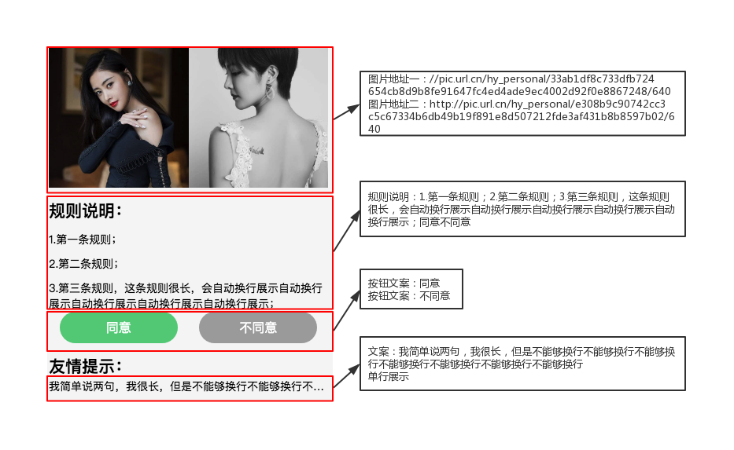

# 示例一

如果读者已经将示例项目下载下来，并使用`npm start`在本地运行起整个项目了的话，可以在http://localhost:3000/simple下 查看示例项目的界面，如下图


示例一的测试代码在DevOpts/matman-app/src/testers/page-simple下

## 参数设置

DevOpts/matman-app/src/testers/page-simple下的cases文件夹存储的是测试文件夹，一个测试文件夹中通常包含两个文件：index.js和index.test.js。

其中：

- index.js中包含对测试过程的设置，比如测试页面的大小，测试时数据的mock，测试过程中的模拟操作等。
- index.test.js中包含对各个阶段测试数据的比较和测试。

对测试思想还希望有深入了解的可以参考[数据快照](../main-concepts/data-snapshot.md)

可以看到page-simple下的cases文件夹有两个测试文件夹，我们先关注jQuery-check中的测试代码。

查看index.js，可以看到如下代码

```js
const env = require('../../env');

function getResult(opts) {
    // 1. 获取 caseParser对象
    const caseParser = env.getCaseParser(__dirname);

    // 2. 获取页面的 url
    const pageUrl = env.getPageUrl(true);

    // 3. 获取 crawlerScript 爬虫脚本路径
    const crawlerScriptPath = caseParser.getCrawlerScriptPath('../../crawlers/get-page-info-jquery');

    // 4. 获得一些配置参数
    const reqOpts = Object.assign({
        proxyServer: env.getProxyServer(false),
        wait: env.OPTS.WAIT,
        screenshot: true
    }, opts);

    // console.log(reqOpts);

    // TODO 应该在 useRecorder 为 true 时支持延时关闭，否则可能会造成来不及收集到数据上报信息
    // 5. 执行并返回 Promise 结果
    return caseParser.handleScan(pageUrl, crawlerScriptPath, reqOpts);
}

module.exports = getResult;
```

- caseParse是用来指定测试代码所在位置的方法，默认指定的是当前文件夹。

- pageUrl即为要测试的页面的地址，可以进入对应的env文件夹下的index.js中修改为本用例对应的页面地址，即`http://localhost:3000/simple`

- crawlerScriptPath对应的是爬虫脚本，即通常名为get-page-info的文件，在getCrawlerScriptPath()中传对应文件的相对路径来引用

- reqOpts中存储一些运行时的信息，包括是否在测试过程中代理服务器，等待时间，是否截屏等等。其中
    - proxyServer用来判断是否要使用代理，在env.getProxyServer()方法中传true时，matman运行时会使用8080端口作为自己的代理端口；设置为false时，matman运行时直接走现网不使用任何代理。如果想使用其余的端口可以在DevOpts/matman-app/src/lib/utils.js下的getProxyServer方法中再行设置；
    - wait用来判定何时认为页面已经加载完。OPTS.WAIT对应的值有两种形式。可以直接接数字代表加载时间（单位为秒）；也可以接上代码中所示的选择器，监听到该选择器对应的元素存在即代表页面加载完成，可以在对应的文件下进行修改。
    - screenshot用来设置是否要在用例执行过程中进行截图，设置为true则用例运行的每一步都会有对应的截图；设置为false则不会有截图。

reqOpts的参数和对应的意义可以参考[matman文档](https://www.npmjs.com/package/matman#213-handleoperatepageurl-crawlerscriptpath-opts---callaction)

最后将这些信息作为参数传递给用例，作为用例的运行时参数

## 爬虫脚本

matman测试的思路可以这么简化理解：按照用例运行操作，记录每一步的操作时界面上的信息，和正确的信息进行比对。

为了获取界面上的信息，就需要书写爬虫脚本。

可以将示例页面的信息从上到下大致分为四部分：

- 上方的两个图片，其中的关键信息是两个图片的地址
- 中间的规则说明，其中的关键信息是规则说明的文案
- 中下部的两个按钮，其中的关键信息是按钮的样式
- 最下方的友情提示，其中的关键信息是友情提示的文案和友情提示是否正常单行展示

预期效果如下：



对于页面有个大致的模块划分之后，接下来就可以开始写爬虫脚本了。

对比上面的index.js，可以看到里面是指定相对路径为../../crawlers/get-page-info-jquery的文件作为爬虫脚本的，里面有示例的代码。

爬虫脚本中需要将爬取元素的函数提供给外部调用，如下

```js
module.exports = () => {
    return {
        //顶部图片信息获取
        topImageInfo: getTopImageInfo(),
        //中央规则信息获取
        middleRule: getMiddleRule(),
        //按钮状态信息获取
        buttonCondition: getButtonCondition(),
        //单行文本信息获取
        oneLineText: getOneLineText()
    };
};
```

### 顶部图片

首先定义一个获取顶部图片信息的方法

```js
/**
 * 顶层图片信息
 */
function getTopImageInfo() {
    
}
```

打开chrome控制台来查看页面元素，可以看到顶部两个图片的代码如下：

```html
<div id="anchors" class="section">
    
    <div class="use-background" 
    style="background-image: url(&quot;//pic.url.cn/hy_personal/e308b9c90742cc3c5c67334b6db49b19f891e8d507212fde3af431b8b8597b02/640&quot;);"></div>
</div>
```

首先可以看到，两个图片同属于大的id为anchors的div，因此可以先判断这个div元素是否存在，存在的情况下再去提取内部两个图片的信息

爬虫脚本中支持使用jquery语法，因此可以使用$(选择器)的方式获取到元素的数量，从而判断是否存在该元素

```js
const parentSelector = '#anchors';
const result = {
    isExist: $(parentSelector).length > 0
};
```

同时matman也提供了封装好的方法来提取元素的信息，要使用封装的方法，需要在头部引用对应的文件。

```js
const {
    useJquery
} = require('web-crawl-util');
```

获取父选择器的代码如果是使用useJquery的话，可以如下这般书写。

```js
const parentSelector = '#anchors';

const result = {
    isExist: useJquery.isExist(parentSelector)
};
```

当parentSelector存在时，开始进行图片的爬取。
如上，可以用jQuery的方式获取到两个元素的图片地址，示例代码如下：

```js
if (result.isExist) {
        result.anchor1 = $.trim($('.use-img', parentSelector).attr('src'));
        result.anchor2 = (document.defaultView.getComputedStyle(
            $('.use-background', parentSelector)[0]
        ).backgroundImage.match(/url\("(.*)"\)/) || [])[1] || '';
    }
```

同理，使用useJquery可以这样书写

```js
if (result.isExist) {
    result.anchor1 = useJquery.getImageDomUrl('.use-img', parentSelector);
    result.anchor2 = useJquery.getBackgroundImageUrl('.use-background', parentSelector);
}
```

最后将得到的结果返回，一个完整的爬取顶层图片的函数就书写完了。