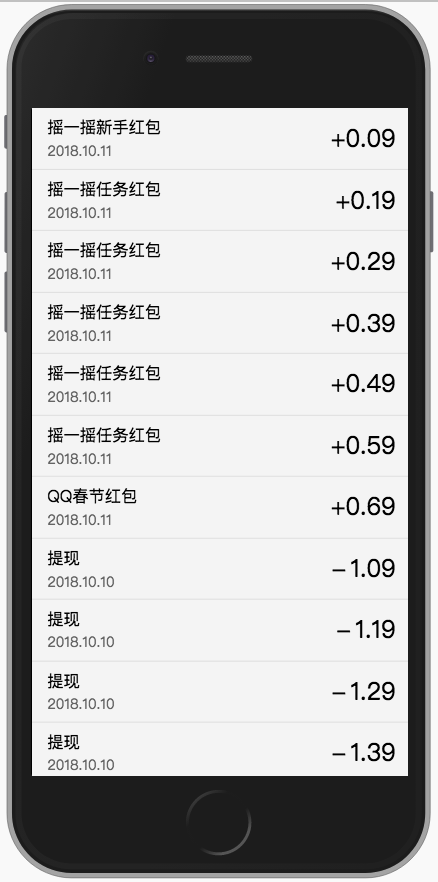

# 示例二

运行示例项目后，示例二的页面地址为 `http://localhost:3000/transaction` ，但是直接访问可以看到什么都没有，这是因为示例二的页面发送的http请求没有数据导致的。

如果需要看到界面的话，需要设置桩数据和代理，参见 [启动和运行](./start.md) ，之后，还需要设置 `switchOmega` ，参见 [switchOmega](../third-party/switchOmega.md)

全部完成后，可以看见如下界面：



## 执行前修改桩数据

实际进行自动化测试的过程中需要覆盖多种不同的场景，端到端测试是以构造不同的cgi的方式来实现这个能力的。

打开 `page-transaction` 下的 [index.js](https://github.com/matmanjs/matman-demo/blob/master/DevOpts/matman-app/src/testers/page-transaction/cases/basic-check/index.js)

大部分的语句在 [简单静态页面](./transaction.md) 中都已经解释了，要添加mock数据的话，比起之前，需要多设置两个地方：

1. `proxyServer` : `env.getProxyServer(true)` , `mock` 数据是以代理的形式作用在测试过程中的，因此需要打开代理服务器

2. `mockstarQuery` : `env.mockstarCases.getBasicFlow()` ，设置 `mock` 数据的来源

可以看到 `getBasicFlow()` 是定义在 [mockstar-cases.js](https://github.com/matmanjs/matman-demo/blob/master/DevOpts/matman-app/src/testers/page-transaction/env/mockstar-cases.js) 里面

这个文件是matman和mockstar之间进行交互的文件，关于 `mockstar` 的内容请参见 [mockstar](https://mockstarjs.gitbook.io/cookbook/)

- `DEFAULT_MOCK` : 以json形式存储默认情况下的mock数据，key为mocker名，value为mock的名字。

- `getMockStarQuery` : 用于将json形式表示的mock数据转成mock数据

有上述两个方式之后，就可以自定义方法来组装自己的mock了。如示例里提供的 `getBasicFlow` 和 `getEmptyFlow` 。最后将 `getMockStarQuery` 的结果作为返回值，就完成了一个 `mock` 方法，然后在 `index.js` 里就可以进行调用了。

## 测试代码的书写

与 [示例一](./transaction.md) 相同，设置完 `index.js` 里面的初始参数后，就可以开始书写爬虫脚本了。

检查界面元素，可以看到界面上每一行都是一个`div`，每个`div`的`class`的属性均为`list-item`。如下

```html
<div class="display-transaction-list">
    <div class="list-item " data-id="id_1_1539224581000_6">
        <div class="info">
            <div class="flow-info">摇一摇新手红包</div>
            <div class="flow-time">2018.10.11</div>
        </div>
        <div class="money">
            <span class="plus">+</span>0.09
        </div>
    </div>
    ...
</div>
```

所以爬取脚本的时候可以以 `class` 值为 `display-transaction-list` 的元素，遍历其下的各个子元素信息，如下

```js
/**
 * 列表项信息
 */
function getListTransactionItemInfo(parentSelector) {
    const result = {
        isExist: useJquery.isExist(parentSelector)
    };

    if (result.isExist) {
        result.name = useJquery.getText('.info .flow-info', parentSelector);
        result.time = useJquery.getText('.info .flow-time', parentSelector);
        result.money = useJquery.getText('.money', parentSelector);
        result.isExpire = useJquery.isExist('.dated-icon', parentSelector);
        result.id = $(parentSelector).attr('data-id');
    }

    return result;
}

/**
 * 列表信息
 */
function getTransactionListInfo() {
    const parentSelector = '#root .display-transaction';

    const result = {
        isExist: useJquery.isExist(parentSelector)
    };

    if (result.isExist) {
        // 总数
        result.total = useJquery.getTotal('.display-transaction-list .list-item', parentSelector);

        const list = [];

        $('.display-transaction-list .list-item', parentSelector).each(function () {
            list.push(getListTransactionItemInfo($(this)));
        });

        // 列表内容
        result.list = list;

        // 列表为空时的文字
        result.emptyWording = useJquery.getText('.display-transaction-empty p', parentSelector);
    }
    return result;
}

```